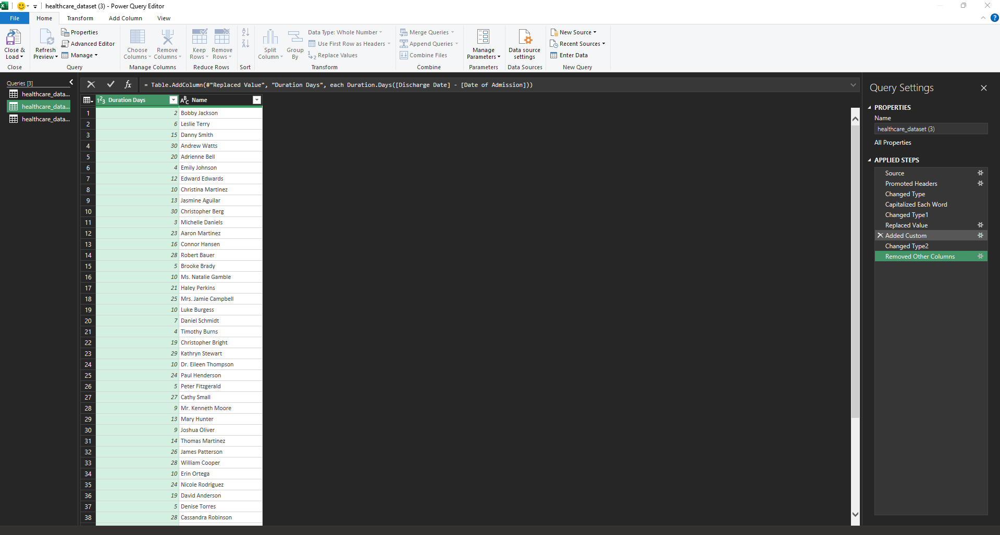
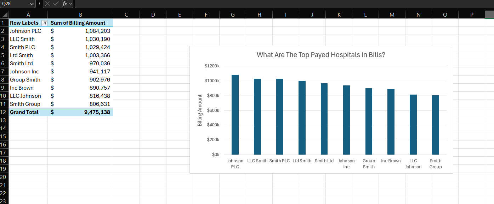
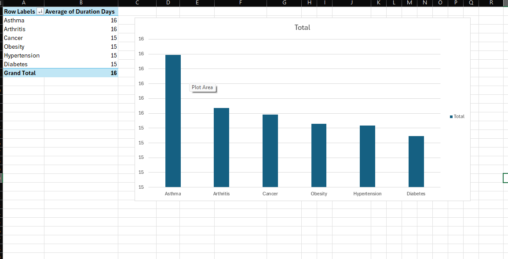

# HealthCare_dataset

Health Care data

# Healthcare Data Analysis & Operational Metrics

## Project Overview

**Description**: This project involves the cleaning, transformation, and analysis of a large healthcare dataset (55,000+ records) to extract operational insights regarding hospital billing, patient length of stay, and medication patterns.The goal was to normalize inconsistent data entries and evaluate the relationship between medical conditions and hospital resources.

**Key Objectives**:

- **Data Cleaning** : Standardizing patient names and handling textual inconsistencies using Power Query.
- **Feature Engineering**: deriving new metrics such as "Length of Stay" to enable time-based analysis.
- **Exploratory Data Analysis (EDA)**: Investigating billing patterns across different hospitals and insurance providers.

### 2. Tools & Technologies Used

- **Microsoft Excel**: Core tool for analysis.
- **Power Query (M Language)**: Used for ETL (Extract, Transform, Load), specifically for:
  - Capitalization and trimming of text data.
  - Conditional logic to handle null values.
- **Pivot Tables**: Used for summarizing complex data points.

### 3. Data Cleaning & Transformation

Before analysis, the raw data required significant preprocessing.

- **Name Normalization**: Corrected mixed-case naming conventions (e.g., `bObbY JaCkSon` $\to$ `Bobby Jackson`) to ensure accurate aggregation.
- **Duration Calculation**: Created a dynamic `Length of Stay` column by calculating the delta between _Discharge Date_ and _Admission Date_.
  

### Key Findings & Analysis

**A. Hospital Billing Analysis** I analyzed the total revenue generated by various hospital entities.The analysis highlighted the top revenue-generating facilities, led by "Johnson PLC" and "LLC Smith.".

**B. Clinical Metrics: Length of Stay (LoS)** By calculating the duration of hospitalization for various conditions (Cancer, Diabetes, Asthma), I attempted to identify resource-heavy conditions.
**Observation**: The analysis revealed a uniform Average LoS (~15.5 days) across all conditions.

**Critical Insight**: The lack of variance between an acute condition (like Asthma) and a chronic condition (like Cancer) suggests this is a synthetic dataset intended for technical practice rather than clinical decision-making.

**C. Insurance & Test Results** An analysis of test results (Normal vs. Abnormal) distributed by Insurance Provider showed an even distribution, further confirming the synthetic nature of the data distribution.

### 5. Conclusion

This project demonstrated the capability to take raw, messy data and turn it into a structured, analytical format. While the dataset's synthetic nature limited the ability to derive real-world clinical interventions, the process successfully validated:

1. **ETL Proficiency**: Using Power Query to automate data cleaning.
2. **Data Integrity** Checks: Using statistical averages (like Length of Stay) to validate the authenticity of data.
3. **Reporting**: creating summary views for financial and operational metrics.
